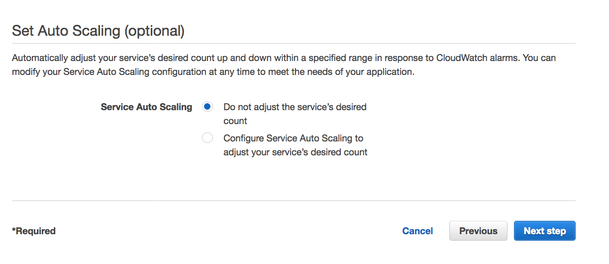

## Lab 3 : CI/CD for ECS


#### 1.3 Configure CodeCommit and Git credentials

##### 1. Create a CodeCommit repository
 
 Refer : 
  https://docs.aws.amazon.com/codecommit/latest/userguide/setting-up.html#setting-up-standard
 
1. create a repository in CodeCommit

```
 aws codecommit create-repository --repository-name java-workshop-docker --region <YOUR REGION>    
```

2. Download your CodeCommeit credentials from IAM
	
3. Create a credentials

```
git config --global credential.helper '!aws codecommit credential-helper $@'
git config --global credential.UseHttpPath true
      
```


### 2 Create a builder project for a docker image

refer : https://docs.aws.amazon.com/codebuild/latest/userguide/sample-docker.html
	
- There is 2 builder json file. create-dock-builder.json and create-java-builder.json	
- create-java-builder.json is a file for creating CodeBuild for compiling and packaging Java source code to JAR output file.
- create-dock-builder.json is a file for creating CodeBuild for creating docker images 
	
#### 2.1. Change Builder files

1. Change the values accoriding to your environments
2. CodeCommit URL, region-ID, account-ID,Amazon-ECR-repo-name and role-name ARN

```
{
  "name": "sample-docker-project",
  "source": {
    "type": "CODECOMMIT",
    "location": "<YOUR code commit URL>"
  },
  "artifacts": {
    "type": "NO_ARTIFACTS"
  },
  "environment": {
    "type": "LINUX_CONTAINER",
    "image": "aws/codebuild/docker:17.09.0",
    "computeType": "BUILD_GENERAL1_SMALL",
    "environmentVariables": [
      {
        "name": "AWS_DEFAULT_REGION",
        "value": "region-ID"
      },
      {
        "name": "AWS_ACCOUNT_ID",
        "value": "account-ID"
      },
      {
        "name": "IMAGE_REPO_NAME",
        "value": "Amazon-ECR-repo-name"
      },
      {
        "name": "IMAGE_TAG",
        "value": "latest"
      }
    ]
  },
  "serviceRole": "arn:aws:iam::account-ID:role/role-name"
}

```

#### 2.2. Create a builder project

1. Create a Java builder

```
aws codebuild create-project --cli-input-json file://create-java-builder.json
```

2. Create a docker builder
	
```	
aws codebuild create-project --cli-input-json file://create-dock-builder.json
```


#### 2.3. Commit a source to new CodeCommit repository

1. Clone CodeCommit repo in your local directory

```
cd <your workspace>

git clone <REPO>

cd java-workshop-docker

cp -R <YOUR PROJECT>/* .

```

2. Commit source code
	
```
git add .
git commit -m "first"
git push
```

#### 2.4. Start Build
- Run each CodeBuild, first, java builder then run docker builder

1. In your Codebuild Console, click a Start Build Button


	2. Select master branch


		

#### 2.5. Check Your Roles for CoudeBuild

Check your build result and if your role dosn't have enough privilege then add more access privilege on access policy.

1. Give a full CloudWatch Write privilege
2. Give a full ECR privilege


<hr>

#### 2.6. Check pushed image in your local machine

1. You can describle the iamges withing a repository with following command.

```
aws ecr describe-images --repository-name java-workshop

```

2. Pull the image using the docker pull

```
docker pull <aws_account_id>.dkr.ecr.<your_region>.amazonaws.com/java-workshop:latest

docker pull 550622896891.dkr.ecr.ap-southeast-1.amazonaws.com/java-workshop:latest

docker images 

docker run -d -p 80:8080 --name=hello-world <IMAGE_ID>

docker run -d -p 80:8080 --name=hello-world 6f9c0d0b1c56

docker ps
```

### 3 Create CICD for docker (new cluster)

https://docs.aws.amazon.com/AmazonECS/latest/developerguide/ecs-cd-pipeline.html

#### 3.1 Create ECS cluster

1. Create a cluster
 	


2. Select linux cluster

 
 
 
3. Specify Cluster configuration

- Cluster Name 				: Java-cluster
- EC2 instance type 		: m4.xlarge
- Number of instances 	: 1
- Security Group 			: Create a new security Group
- Role									: Select a EC2 instance role to support your Task (need to create a new role)


 
 
#### 3.2 Create Task definition

1. Specify information

- Task Definition Name : java-workshop
- Network Mode : Bridge
- Task memory (MiB) : 512
- Task CPU (unit) : 200

 

2. Specify container information
	
- **Container name** : **java-container**
- **Image** : <YOUR ECR image ARN> (for example, <account-id>.dkr.ecr.ap-southeast-1.amazonaws.com/java-workshop	)
- Memory Limits (MiB) : 128
- Port mapping : 80 : 8080

 

 
#### 3.3 Create Service definition


1. Configure service
	
- Task Definition 					: select a task you created in task definition
- Cluster 									: select the cluster (Java-cluster)
- Service name 						: java-service
- Number of tasks 					: 1
- Minimum healthy percent 	: 50
- Maximum percent 					: 200	

- Placement Templates : AZ Balanced spread

 


2. Configure network
- None load balancer

 
 
  
3.	Cofigure autoscaling
- None

 
 
 	

#### 3.4 Add imagedefinition.json in your root directory of source codes

- name is the container name you defined in task definition 

```
[
    {
        "name": "java-container",
        "imageUri": "550622896891.dkr.ecr.ap-southeast-1.amazonaws.com/java-workshop"
    }
]

```

### 4. Complete a CI/CD

#### 4.1 Add deploy stage

1. Add deploy stage in your CI/CD
- Action category: Deploy
- Action name : Specify your service name 
- Deployment provide : Amazon ECS
- Cluster name : Java-cluster (Specify your cluster name you created)
- Service name : java-service (Select service name you created )
- Image filename : imagedefinition.json (The file name you added in previous step)
- Input artifacts : Specify the artifact name of previous stage

 


#### 4.2 Deploy your application

1. Change code and deploy it
	
 	

